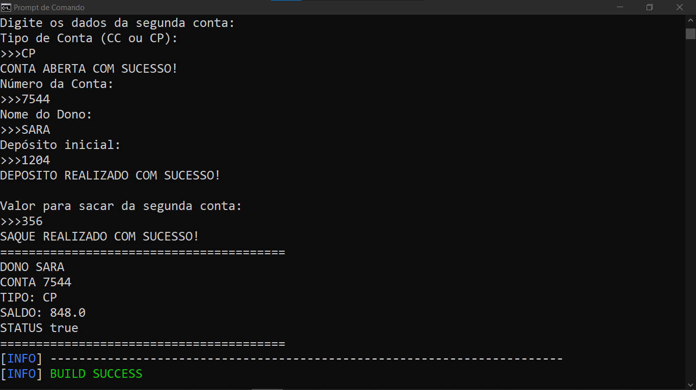

# CONTA DO BANCO
👨‍🏫PROJETO CRIADO PARA O CURSO DE JAVA DO CURSO EM VIDEO.

 <br>

## DESCRIÇÃO:
O projeto **"Conta Banco"** é uma aplicação simples de gestão de contas bancárias em Java, que simula operações bancárias comuns, como abrir conta, depositar, sacar, pagar mensalidades, e fechar a conta. O sistema trabalha com dois tipos de contas:

- **Conta Corrente (CC)**: Inicializa com um saldo de R$50,00.
- **Conta Poupança (CP)**: Inicializa com um saldo de R$150,00.

O sistema permite a interação com múltiplas contas, realizando operações como depósitos e saques, e verifica as condições necessárias para fechamento de contas ou operações especiais, como o pagamento de mensalidades.

## FUNCIONALIDADES:
- **Abrir Conta**: Abre uma conta corrente ou poupança.
- **Fechar Conta**: Verifica o saldo antes de permitir o fechamento da conta.
- **Depositar**: Adiciona saldo à conta.
- **Sacar**: Retira saldo, verificando a disponibilidade e o status da conta.
- **Pagar Mensalidade**: Deduz uma taxa mensal de acordo com o tipo da conta.
- **Ver Estado Atual**: Exibe os detalhes da conta, como dono, número, saldo, tipo e status.

## EXECUTANDO O PROJETO:
1. **Certifique-se de que o projeto esteja compilado:**
   Antes de executar o projeto, você deve garantir que ele foi compilado corretamente. Navegue até o diretório `./CODIGO`, e use o seguinte comando para compilar:

   ```bash
   mvn clean install
   ```

2. **Executar o projeto:**
   Para executar a aplicação com o Maven, usando a classe principal definida no seu `pom.xml`, use o comando:

   ```bash
   mvn exec:java
   ```

3. **Operações Básicas:**
   Quando executado, o sistema permitirá que o usuário insira os dados para criar contas, depositar, sacar, pagar mensalidades, ou visualizar o estado da conta, seguindo as interações simuladas no código `ClienteBanco`. Um exemplo de interação com o usuário pode ser a seguinte:

   - Usuário escolhe abrir uma conta do tipo CC (Conta Corrente).
   - Informa um número de conta.
   - Realiza um depósito inicial.
   - Exibe o saldo e os detalhes da conta.

## CREDITOS:
- [PROJETO CRIADO PARA O CURSO DE JAVA](https://github.com/VILHALVA/CURSO-DE-JAVA)
- [PROJETO FEITO PELO VILHALVA](https://github.com/VILHALVA)


